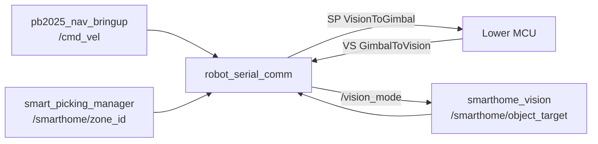

# Architecture

当前工程的实车链路按三个部分拆开启动：导航、视觉+通信、决策。

职责边界：

- `smarthome_vision`：只负责检测目标，发布 `/smarthome/object_target`，订阅 `/vision_mode`。
- `robot_serial_comm`：唯一打开下位机串口的包，负责 SP/VS 两种固定结构体。
- `pb2025_nav_bringup`：导航和 TF。
- `pb2025_sentry_behavior`：默认启动 `smart_picking_manager`，发布当前 A-F 点位。

旧 BT server/client 仍可通过 `enable_legacy_bt:=true` 调试，但默认不启动。
