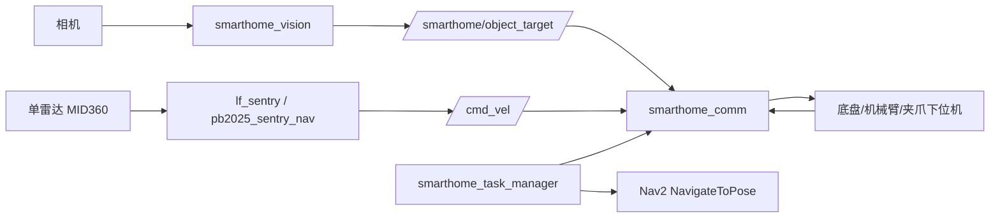

# 工程架构说明

## 1. 模块边界



## 2. 导航链路

使用 `lf_sentry/pb2025_sentry_nav` 中的实车导航启动文件。单雷达配置时只保留一套 Livox 驱动、point_lio、small_gicp、terrain_analysis、Nav2 控制器。

建议链路：

```text
Livox MID360
  -> livox_ros_driver2
  -> point_lio
  -> loam_interface / sensor_scan_generation
  -> terrain_analysis / pointcloud_to_laserscan
  -> Nav2 global planner + local controller
  -> /cmd_vel
  -> smarthome_comm
  -> 下位机底盘控制
```

## 3. 视觉链路

`smarthome_vision` 负责相机采集、TensorRT 推理、物品/二维码检测、PnP 位姿估计。集成后视觉节点不再直接串口发送目标，而是发布统一目标消息：

```text
/camera/image_raw
  -> smarthome_vision_node
  -> /smarthome/object_target
  -> smarthome_comm
```

## 4. 任务状态机

比赛流程不写死在导航或视觉包里，而是放在 `smarthome_task_manager`：

```text
B 区导航 -> C 区导航 -> D 区导航
-> 等待目标 -> 抓取 -> E 区导航 -> 分类放置
-> F 区导航 -> 结束
```

## 5. 为什么把通信单独成包

1. 串口只能被一个进程稳定占用。
2. 下位机协议应与视觉/导航算法解耦。
3. 调试时可以单独 echo `/smarthome/comm/raw_tx` 和 `/smarthome/comm/raw_rx`。
4. 后续从串口换 CAN、UDP 或共享内存时，上层任务和算法不需要改。
